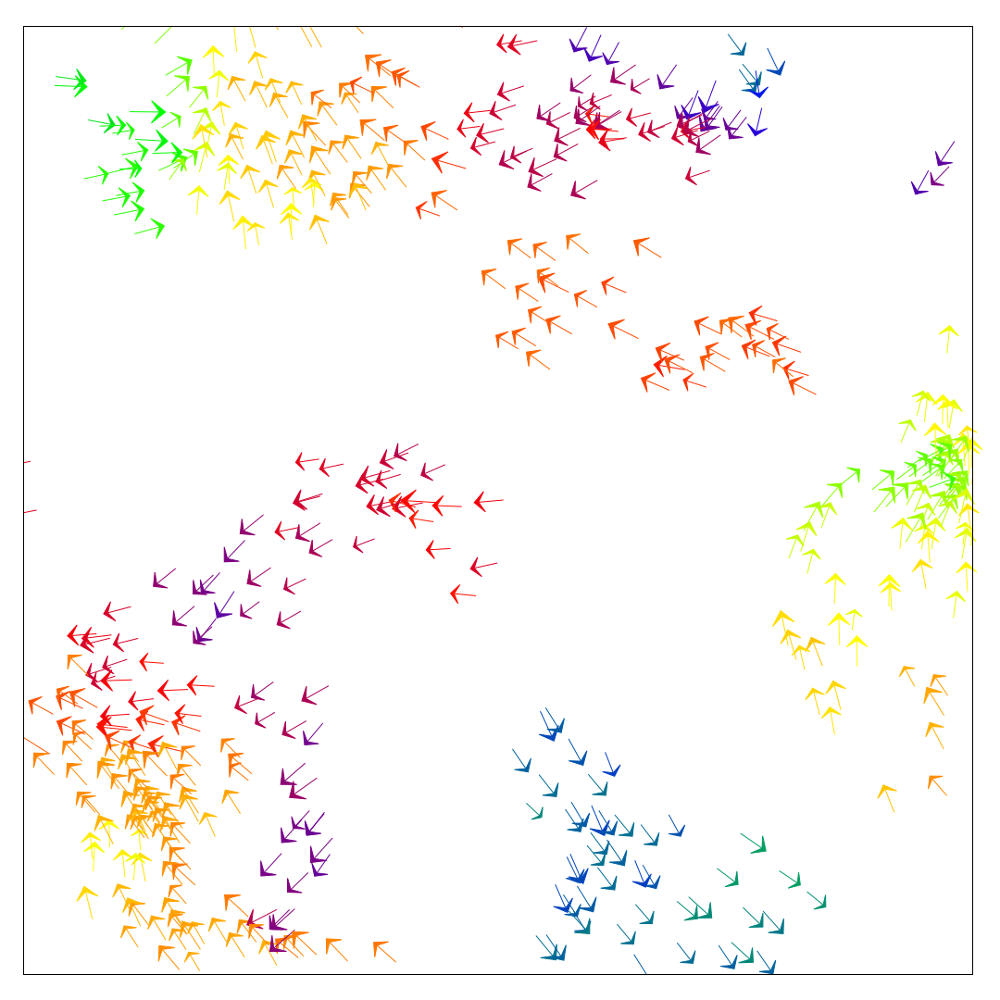

vicsek
------

This is an implementation of a (modified) [Vicsek model](https://doi.org/10.1103/PhysRevLett.75.1226)
for flocking behavior.

It is implemented in Rust and will show an OpenGL animation. Via command line
argument one can create a .mp4 using `gnuplot` and `ffmpeg`.
