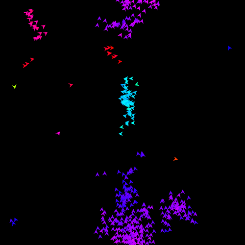

# Vicsek :bird::bird::bird:

This is an implementation of a (modified) [Vicsek model](https://doi.org/10.1103/PhysRevLett.75.1226)
for flocking behavior.



It is implemented in Rust and will show an animation.

Just visit [surt91.github.io/vicsek/](https://surt91.github.io/vicsek/) to watch!

## Locally

Just start it with `cargo`, (you can get it at, eg., [rustup.rs](https://rustup.rs/)):

```bash
cargo run --release
```

On Debian you need to first run:

`sudo apt-get install libxcb-render0-dev libxcb-shape0-dev libxcb-xfixes0-dev libxkbcommon-dev libssl-dev`

On Fedora Rawhide you need to run:

`dnf install clang clang-devel clang-tools-extra libxkbcommon-devel pkg-config openssl-devel libxcb-devel gtk3-devel atk fontconfig-devel`

## Web Locally

We use [Trunk](https://trunkrs.dev/) to build for web target.
1. Install the required target with `rustup target add wasm32-unknown-unknown`.
2. Install Trunk with `cargo install --locked trunk`.
3. Run `trunk serve` to build and serve on `http://127.0.0.1:8080`. Trunk will rebuild automatically if you edit the project.
4. Open `http://127.0.0.1:8080/index.html#dev` in a browser. See the warning below.

## Web Deploy

1. Just run `trunk build --release`.
2. It will generate a `dist` directory as a "static html" website
3. Upload the `dist` directory to any of the numerous free hosting websites including [GitHub Pages](https://docs.github.com/en/free-pro-team@latest/github/working-with-github-pages/configuring-a-publishing-source-for-your-github-pages-site).

## :whale: Docker

If you are running Linux and have an X server installed (if you do not know what
this means, it is probably true; XWayland does also work), you can also use the provided docker container:

```bash
docker-compose build
# this is needed to allow access to your X-server from within the Docker container
xhost +local:
docker-compose up
```
